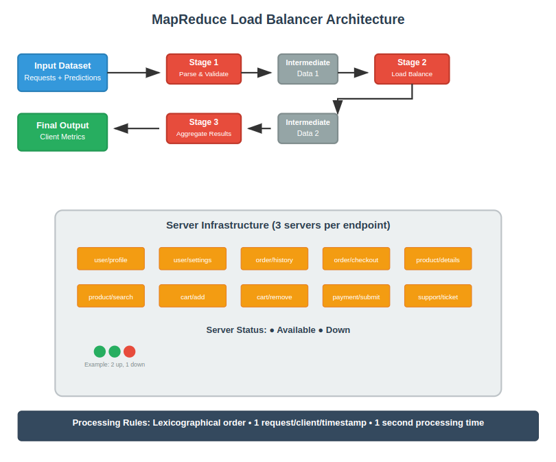

# MapReduce Load Balancer Simulator

A distributed system simulation that predicts HTTP status codes for client requests using a 3-stage MapReduce pipeline. The system models server downtime, request routing, and client success metrics for various API endpoints.

## 🎯 Overview

This project simulates a load balancer that:
- Routes client requests to available servers across 10 different endpoints
- Handles server downtime scenarios (each endpoint has 3 servers)
- Validates predicted status codes against actual server responses
- Calculates client success metrics and total costs

## 🏗️ Architecture



The solution uses a **3-stage MapReduce pipeline**:

1. **Stage 1**: Request parsing and validation
2. **Stage 2**: Load balancing and status code determination
3. **Stage 3**: Client metrics aggregation and cost calculation

## 📊 Supported Endpoints

| Endpoint | Price | Description |
|----------|-------|-------------|
| `user/profile` | 100 | Access/update user profile |
| `user/settings` | 200 | Modify user preferences |
| `order/history` | 300 | Retrieve order history |
| `order/checkout` | 400 | Complete checkout process |
| `product/details` | 500 | View product information |
| `product/search` | 600 | Search products |
| `cart/add` | 700 | Add items to cart |
| `cart/remove` | 800 | Remove items from cart |
| `payment/submit` | 900 | Process payments |
| `support/ticket` | 1000 | Customer support |

## 🔧 Business Rules

- **Request Processing**: Lexicographical order for same timestamp
- **Client Limitation**: One request per client per timestamp
- **Server Capacity**: 3 servers per endpoint
- **Processing Time**: 1 second per request
- **Status Codes**: 200 (Success) or 500 (Server Error)

## 🚀 Usage

### Prerequisites
- Hadoop 3.3.6+ installed and configured
- HDFS running
- Python 3.x available on all nodes

### Running the Job

1. **Upload dataset to HDFS:**
```bash
hdfs dfs -put data/dataset.txt /task2/dataset.txt
```

2. **Execute the MapReduce pipeline:**
```bash
chmod +x run_job.sh
./run_job.sh
```

3. **View results:**
```bash
hdfs dfs -cat /task2/output/part-00000
```

### Input Format

**Request Data (space-separated):**
```
request_id client_id endpoint timestamp no_of_servers_down
```

**Predictions (space-separated):**
```
request_id predicted_status_code
```

### Output Format

```
client_id successful_predictions/total_requests total_price
```

## 📈 Example

**Input:**
```
r001 c01 user/profile 00:00:00 2.0
r002 c02 user/profile 00:00:00 2.0

r001 500
r002 500
```

**Output:**
```
c01 1/1 100
c02 0/1 0
```

## 🔍 Key Features

- **Fault Tolerance**: Handles server downtime gracefully
- **Scalability**: Distributed processing across Hadoop cluster
- **Accuracy**: Validates predictions against actual server responses
- **Cost Tracking**: Calculates total expenses per client
- **Time-based Processing**: Respects request timestamps and processing delays

## ⚡ Performance Considerations

- Requests are processed in lexicographical order within timestamps
- Only one request per client per timestamp is allowed
- Server availability is checked in real-time
- Cost is only charged for successful requests (status 200)

## 🔗 Related Technologies

- **Apache Hadoop**: Distributed computing framework
- **MapReduce**: Programming model for large-scale data processing
- **HDFS**: Hadoop Distributed File System
- **Python**: Implementation language
